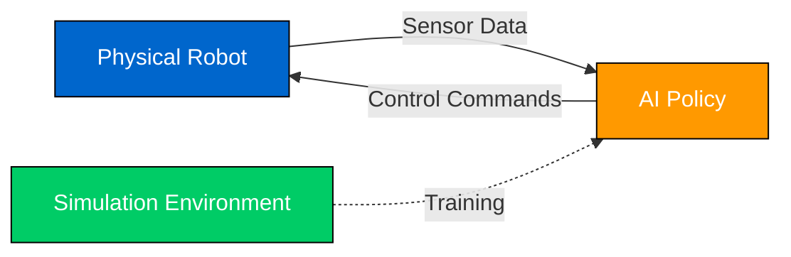
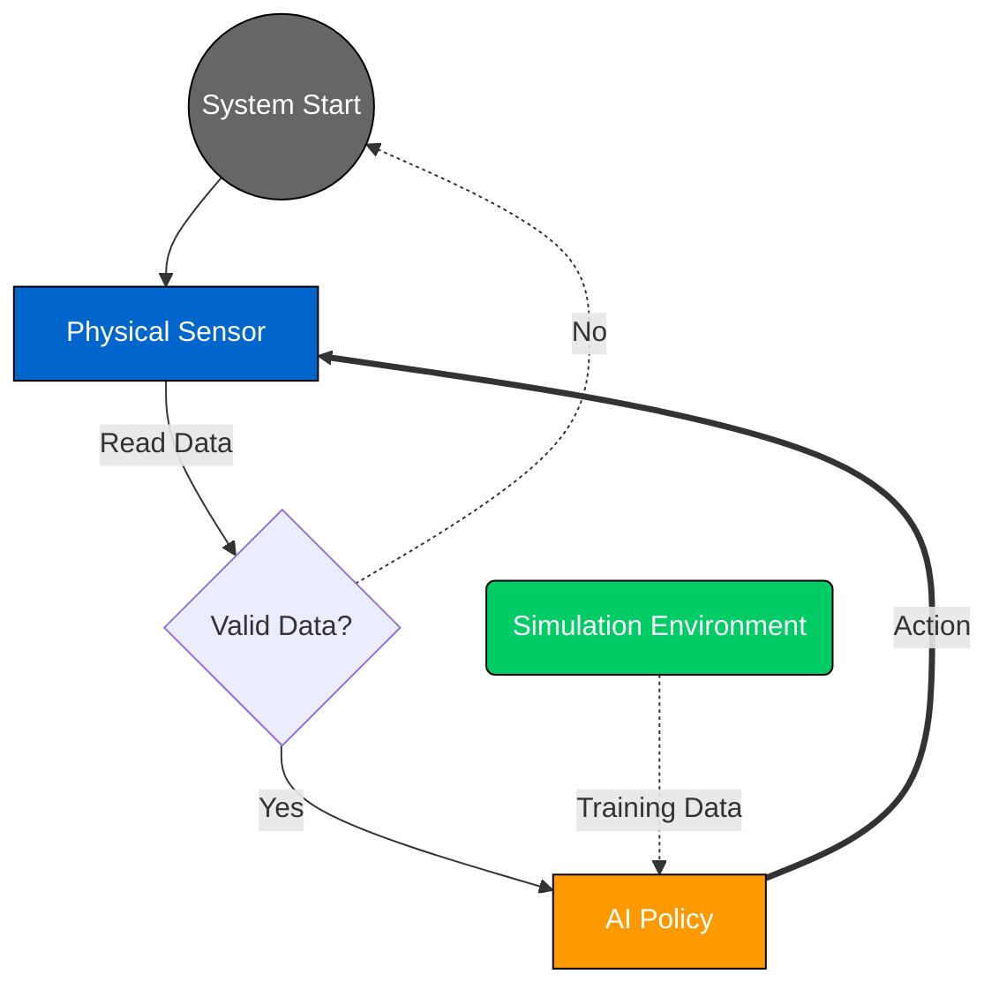

# Diagram Style Guide

**Purpose**: Ensure visual consistency across all diagrams in the Physical AI, Simulation AI & Humanoid Robotics book

**Created**: 2025-11-30
**Version**: 1.0.0
**Compliance**: Article 10 (Visualization Requirements)

---

## Color Palette

All diagrams MUST use this standard color palette for consistency:

| Color | Hex Code | Usage | Context |
|-------|----------|-------|---------|
| **Blue** | `#0066CC` | Physical Robotics | Hardware, sensors, actuators, mechanical systems |
| **Green** | `#00CC66` | Simulation | Virtual environments, physics engines, digital twins |
| **Orange** | `#FF9900` | AI/ML Components | Neural networks, RL policies, training pipelines |
| **Gray** | `#666666` | General/Framework | Shared infrastructure, abstract concepts, controllers |
| **Black** | `#000000` | Text & Borders | Labels, arrows, component outlines |
| **White** | `#FFFFFF` | Background | Canvas, clear space |

### Color Usage Examples



**Rule**: Use colors semantically. Physical components = Blue, Simulation = Green, AI/ML = Orange.

---

## Notation Standards

### Arrows

| Notation | Meaning | Example Usage |
|----------|---------|---------------|
| `-->` (solid) | **Data flow** | Sensor → Controller, Model → Output |
| `-.->` (dashed) | **Control flow** | Start → Process, Condition → Action |
| `==>` (thick) | **Primary path** | Critical data flow, main pipeline |
| `--x` (terminated) | **Blocked/Error** | Failed connection, error state |

### Shapes

| Shape | Notation (Mermaid) | Meaning | Example |
|-------|-------------------|---------|---------|
| **Rectangle** | `[Component]` | System component | Motor, Sensor, Module |
| **Rounded Rectangle** | `(Process)` | Processing step | Data transformation, computation |
| **Circle/Ellipse** | `((Start/End))` | Entry/exit point | System startup, termination |
| **Diamond** | `{Decision}` | Conditional branch | If/else, validation gate |
| **Hexagon** | `{{Database}}` | Data storage | Memory, disk, buffer |
| **Trapezoid** | `[/Input Output\]` | I/O operation | File read, network request |

### Example Diagram with Notation



---

## Labeling Standards

### Font Requirements

- **Font Family**: Sans-serif (Arial, Helvetica, or system default)
- **Minimum Font Size**: 12pt (readable at 100% zoom)
- **Maximum Font Size**: 18pt (for main titles only)
- **Font Weight**: Regular (400) for labels, Bold (700) for headers

### Label Format

**Required Elements**:
1. **Component Labels**: Every box, circle, or shape MUST have a text label
2. **Arrow Labels**: Data flow arrows SHOULD have descriptive labels
3. **Figure Caption**: Every diagram MUST have a numbered caption

**Label Style**:
- Use **Title Case** for component names: "Physical Robot", "AI Policy"
- Use **sentence case** for descriptions: "sends data to controller"
- Avoid abbreviations unless well-known (OK: "AI", "ML", "RL"; Avoid: "Ctrl", "Proc")

### Caption Format

Every diagram MUST have a caption in this format:

```markdown
**Figure {number}: {Clear descriptive title}**

{Optional 1-2 sentence explanation if diagram is complex}
```

**Examples**:
- **Figure 1: Agent Pipeline for Chapter Generation**
- **Figure 2: Dual-Domain Integration Architecture**

  This diagram shows how physical robotics concepts are mapped to simulation equivalents through the integrated understanding layer.

---

## Black & White Readability

**Critical Requirement**: All diagrams MUST be distinguishable in grayscale (for print/accessibility).

### Techniques for B&W Compatibility

1. **Patterns**: Use hatching, stippling, or line patterns in addition to colors
2. **Line Styles**: Vary solid, dashed, dotted lines
3. **Borders**: Use different border thicknesses (1px, 2px, 4px)
4. **Labels**: Always label components (never rely on color alone)

### Grayscale Test

Before finalizing a diagram:
1. Convert to grayscale (most tools: Filters → Grayscale)
2. Verify all elements are distinguishable
3. If any elements are indistinguishable, add patterns or adjust contrast

---

## Diagram Types

### 1. Architecture Diagrams

**Purpose**: Show system structure and component relationships

**Requirements**:
- Use rectangles for components
- Show hierarchical relationships (top = high-level, bottom = detailed)
- Label all connections
- Include legend if >5 component types

**Example Structure**:
```
[High-Level System]
    ├── [Subsystem A]
    │   ├── [Component A1]
    │   └── [Component A2]
    └── [Subsystem B]
        └── [Component B1]
```

### 2. Flow Diagrams

**Purpose**: Show process sequences and decision points

**Requirements**:
- Start/End points clearly marked (circles)
- Decision points as diamonds
- One clear entry and exit point
- No crossing arrows (reroute if needed)

### 3. Mechanical Diagrams

**Purpose**: Show physical robot structure

**Requirements**:
- Blue color scheme (#0066CC)
- Annotate dimensions where relevant
- Show force/torque directions with arrows
- Include safety warnings if hazards present

### 4. Simulation Pipeline Diagrams

**Purpose**: Show data flow in simulation environments

**Requirements**:
- Green color scheme (#00CC66)
- Show input → environment → output flow
- Label state spaces, action spaces
- Indicate training vs inference paths

---

## Mermaid-Specific Guidelines

### Theme Configuration

Use the standard Mermaid theme (see `mermaid-theme.json`):
- Primary color: #0066CC (blue)
- Secondary color: #00CC66 (green)
- Accent color: #FF9900 (orange)
- Font family: "Helvetica Neue", Arial, sans-serif
- Font size: 14px (minimum)

### Diagram Width

- **Target width**: 600-800px (readable on standard screens)
- **Maximum width**: 1200px (avoid horizontal scrolling)
- **Minimum width**: 400px (mobile compatibility)

### Complexity Limits

- **Maximum nodes per diagram**: 20 (beyond this, split into multiple diagrams)
- **Maximum hierarchy depth**: 4 levels (avoid overly nested structures)
- **Maximum connections per node**: 5 (maintain clarity)

---

## Manual Diagram Guidelines

For complex mechanical assemblies or 3D renderings not suitable for Mermaid:

### Tools

- **Preferred**: Inkscape, Adobe Illustrator, Figma (vector graphics)
- **Acceptable**: Technical drawing software (CAD exports)
- **Format**: SVG (scalable), PNG fallback at 300 DPI minimum

### Standards

- Follow same color palette as Mermaid diagrams
- Maintain 12pt minimum font size
- Export at high resolution (300 DPI for raster, vector preferred)
- Include source files (.ai, .svg) for future edits

---

## Quality Checklist

Before submitting any diagram, verify:

- [ ] Uses standard color palette (#0066CC, #00CC66, #FF9900, #666666)
- [ ] All components have clear labels (≥12pt font)
- [ ] Arrows indicate direction and are labeled where needed
- [ ] Figure caption present in format "**Figure N: Title**"
- [ ] Diagram is distinguishable in grayscale
- [ ] Width is 600-1200px (not too narrow or wide)
- [ ] Complexity <20 nodes (split if larger)
- [ ] No overlapping text or crossing unlabeled arrows

---

## Examples

### Good Example


**Figure 3: Dual-Domain Robot Control Architecture**

This diagram shows the interaction between physical hardware, simulation environment, and AI policy layers.

**Why this is good**:
- ✅ Uses standard colors semantically
- ✅ All components clearly labeled with multi-line text
- ✅ Solid arrows for data flow, dashed for control/training
- ✅ Has proper figure caption with explanation
- ✅ Would be clear in grayscale (different shapes + labels)

### Bad Example (DO NOT USE)

```
A -> B -> C -> D
```

**Why this is bad**:
- ❌ No colors or styling
- ❌ Cryptic single-letter labels
- ❌ No indication of what arrows mean
- ❌ No figure caption
- ❌ Not self-explanatory

---

## Revision History

| Version | Date | Changes |
|---------|------|---------|
| 1.0.0 | 2025-11-30 | Initial style guide created |

---

## References

- Article 10 (Visualization Requirements) - Constitution
- Mermaid.js Documentation: https://mermaid.js.org/
- Accessibility Guidelines (WCAG 2.1): Color contrast ratios
