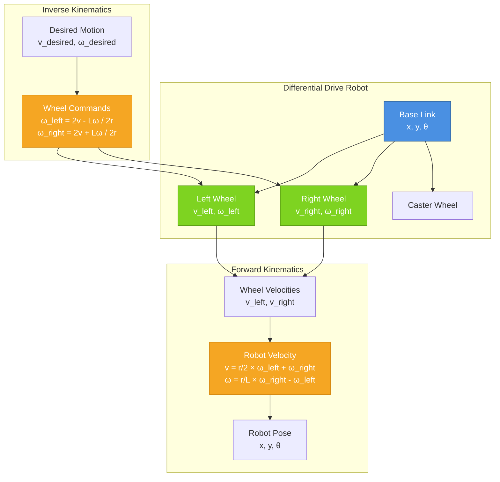

# Diagram: Differential Drive Kinematics

**Type**: Mechanical Diagram  
**Chapter**: P6-C1  
**Purpose**: Illustrate forward and inverse kinematics for differential drive robot

## Diagram Specification

## Description

This diagram shows the relationship between wheel velocities and robot motion for a differential drive mobile robot. The forward kinematics path (top) computes robot velocity and pose from wheel velocities, while the inverse kinematics path (bottom) computes required wheel velocities from desired robot motion.

**Key Elements**:
- Base link with position (x, y) and orientation (θ)
- Two independently driven wheels with velocities v_left and v_right
- Caster wheel for support
- Forward kinematics equations converting wheel velocities to robot motion
- Inverse kinematics equations converting desired motion to wheel commands

**Parameters**:
- L: Wheelbase (distance between wheel centers)
- r: Wheel radius
- v: Linear velocity
- ω: Angular velocity

