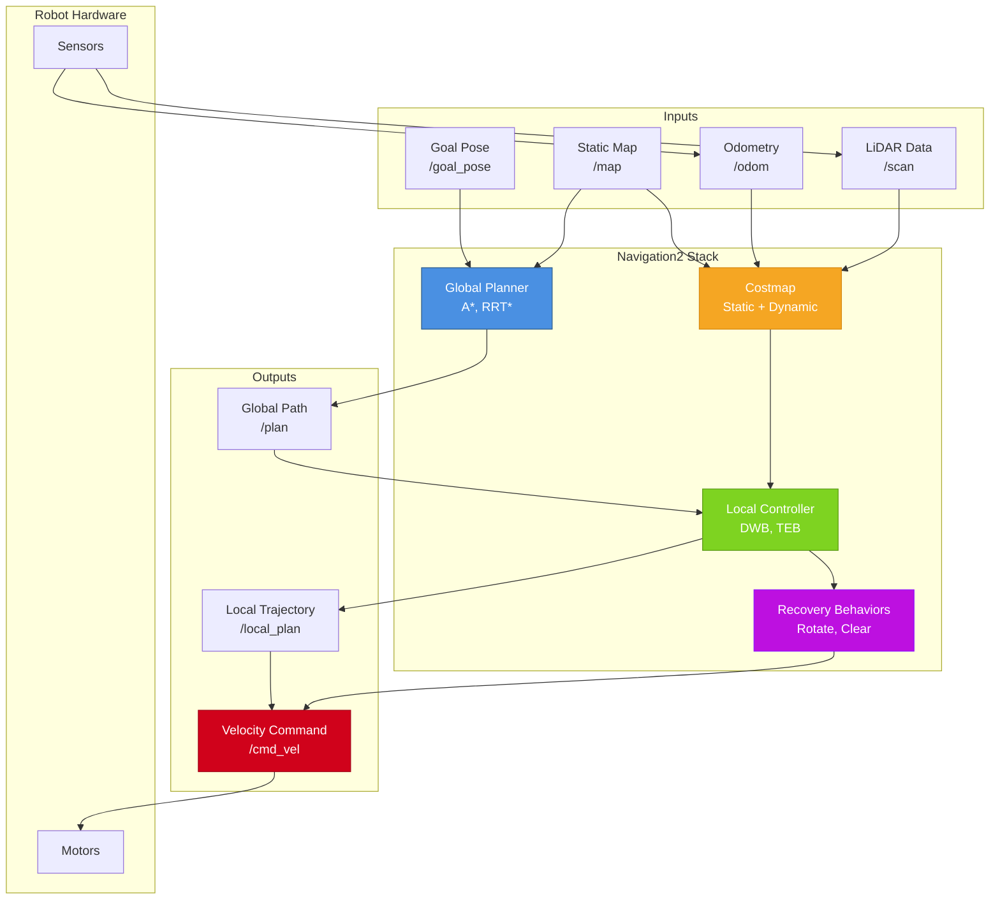

# Diagram: ROS2 Navigation2 Architecture

**Type**: Architecture Diagram  
**Chapter**: P6-C1  
**Purpose**: Illustrate ROS2 Navigation2 stack components and data flow

## Diagram Specification

## Description

This diagram illustrates the ROS2 Navigation2 stack architecture for autonomous mobile robot navigation. The system processes sensor data and goal commands to generate velocity commands for the robot motors.

**Key Components**:
- **Global Planner**: Computes optimal path from start to goal using static map
- **Local Controller**: Follows global path while avoiding dynamic obstacles
- **Costmap**: Grid-based representation of obstacles (static map + dynamic sensor data)
- **Recovery Behaviors**: Handles stuck situations (rotate in place, clear costmap)

**Data Flow**:
1. Goal pose and static map → Global Planner → Global Path
2. Global Path + Costmap → Local Controller → Local Trajectory
3. Local Trajectory → Velocity Commands → Motors
4. Sensors → Odometry + LiDAR → Costmap (updates)

