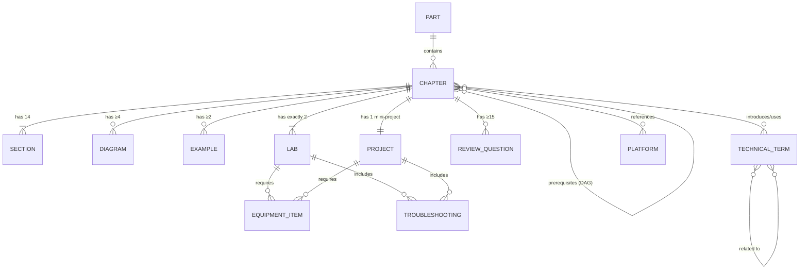

# Data Model

**Feature**: 1-robotics-book-spec — Physical AI, Simulation AI & Humanoid Robotics Book

**Date**: 2025-11-30

**Purpose**: Define entities, relationships, and validation rules for book content.

---

## Core Entities

### Entity: Chapter

**Purpose**: Represents a single book chapter with all required components per Article 7 of the constitution.

**Attributes**:
| Attribute | Type | Description | Validation |
|-----------|------|-------------|------------|
| `chapter_id` | String | Unique identifier (format: "P{part}-C{chapter}") | Required, matches `/^P[1-7]-C\d+$/` |
| `title` | String | Chapter title (concise, descriptive) | Required, 3-50 characters |
| `short_description` | String | 2-3 line summary | Required, 100-300 characters |
| `part_number` | Integer | Part number (1-7) | Required, range 1-7 |
| `chapter_number` | Integer | Sequential within part | Required, ≥1 |
| `learning_objectives` | List<String> | Student outcomes | Required, 3-7 items |
| `keywords` | List<String> | Key terms | Required, 5-15 items |
| `estimated_reading_time` | Integer | Minutes | Required, range 120-240 |
| `estimated_lab_time` | Integer | Minutes | Required, range 120-180 |
| `concept_density` | Float | Calculated density score | Auto-calculated, ≥0 |
| `difficulty_level` | Enum | Beginner, Intermediate, Advanced | Required |
| `prerequisites` | List<String> | chapter_ids of prerequisite chapters | Optional, no circular deps |
| `status` | Enum | Planned, Research, Outline, Structure, Lesson, Draft, Review, Published | Required |
| `version` | Integer | Revision number | Required, ≥1, increments only |

**Relationships**:
```
Chapter 1:1 Part
Chapter 1:N Section (exactly 14 mandatory sections)
Chapter 1:N Diagram (minimum 4: Architecture, Flow, Mechanical, SimulationPipeline)
Chapter 1:N Example (minimum 2: Physical, Simulation)
Chapter 1:N Lab (exactly 2: Simulation, Physical)
Chapter 1:1 MiniProject
Chapter 1:N ReviewQuestion (minimum 15 total: 5 conceptual, 5 calculations, 5 simulation/coding)
Chapter N:N Chapter (prerequisites, acyclic directed graph)
```

**Validation Rules**:
```yaml
required_sections:
  - Introduction
  - Motivation
  - LearningObjectives
  - KeyTerms
  - PhysicalExplanation
  - SimulationExplanation
  - IntegratedUnderstanding
  - Diagrams
  - Examples
  - Labs
  - MiniProjects
  - Applications
  - Summary
  - ReviewQuestions

required_diagrams:
  Architecture: minimum 1
  Flow: minimum 1
  Mechanical: minimum 1
  SimulationPipeline: minimum 1

required_examples:
  Physical: minimum 1
  Simulation: minimum 1

required_labs:
  Simulation: exactly 1
  Physical: exactly 1

review_questions:
  Conceptual: minimum 5
  Calculations: minimum 5
  SimulationCoding: minimum 5

prerequisites:
  - Must reference only prior chapters (no forward references)
  - No circular dependencies (DAG check)
  - All referenced chapter_ids must exist
```

**State Machine**:
```
Planned → Research (research-agent completes research.md)
        → Outline (outliner-agent completes outline.md)
        → Structure (chapter-structure-architect completes structure.md)
        → Lesson (lesson-planner completes lesson.md)
        → Draft (writer-agent completes draft.md)
        → Review (book-editor begins review)
        → Published (book-editor approves, final validation passes)

Transitions can go backwards for revisions:
Review → Draft (major revisions needed, writer-agent re-runs)
Draft → Lesson (structural changes, lesson-planner adjusts)
```

---

### Entity: Section

**Purpose**: One of the 14 mandatory sections within a chapter.

**Attributes**:
| Attribute | Type | Description | Validation |
|-----------|------|-------------|------------|
| `section_id` | String | Unique identifier (format: "{chapter_id}-S{number}") | Required, matches `/^P\d+-C\d+-S\d+$/` |
| `chapter_id` | String | Foreign key to Chapter | Required, must exist |
| `section_number` | Integer | Sequential order (1-14) | Required, range 1-14 |
| `section_type` | Enum | See types below | Required, one of 14 types |
| `content` | Markdown | Section content | Required, non-empty |
| `word_count` | Integer | Total words | Auto-calculated, ≥0 |
| `has_physical_content` | Boolean | Contains physical robotics content | Auto-detected via keywords |
| `has_simulation_content` | Boolean | Contains simulation content | Auto-detected via keywords |

**Section Types** (Enum):
```
- Introduction
- Motivation
- LearningObjectives
- KeyTerms
- PhysicalExplanation
- SimulationExplanation
- IntegratedUnderstanding
- Diagrams
- Examples
- Labs
- MiniProjects
- Applications
- Summary
- ReviewQuestions
```

**Content Requirements** (by type):
```yaml
Motivation:
  word_count: [300, 500]  # 1 page ≈ 300-500 words
  must_include: [real_world_scenario, robotics_example, human_problem]

PhysicalExplanation:
  word_count: [800, 1500]
  must_include: [hardware_description, mechanical_or_electrical_foundations, equations, diagrams, real_robot_examples]
  has_physical_content: true

SimulationExplanation:
  word_count: [800, 1500]
  must_include: [simulation_description, physics_engine_relevance, digital_twin_applications, pipeline_diagrams]
  has_simulation_content: true

IntegratedUnderstanding:
  word_count: [500, 800]
  must_include: [physical_vs_simulation_comparison, sim_to_real_transfer_guidance, domain_gap_analysis]
  has_physical_content: true
  has_simulation_content: true

KeyTerms:
  term_count: [5, 20]
  format: "- **Term**: Definition (simple, beginner-friendly)"

Summary:
  must_include: [key_takeaways (10-15), common_mistakes, practical_tips]

ReviewQuestions:
  conceptual_questions: minimum 5
  calculation_questions: minimum 5
  simulation_coding_questions: minimum 5
```

---

### Entity: Diagram

**Purpose**: Visual representation (architecture, flow, mechanical, simulation pipeline).

**Attributes**:
| Attribute | Type | Description | Validation |
|-----------|------|-------------|------------|
| `diagram_id` | String | Unique identifier (format: "{chapter_id}-D{number}") | Required |
| `chapter_id` | String | Foreign key to Chapter | Required, must exist |
| `diagram_number` | Integer | Sequential within chapter | Required, ≥1 |
| `diagram_type` | Enum | Architecture, Flow, Mechanical, SimulationPipeline, Other | Required |
| `caption` | String | Explanatory text | Required, non-empty |
| `alt_text` | String | Accessibility description | Required, non-empty |
| `source_format` | Enum | Mermaid, SVG, PNG, Manual | Required |
| `source_file` | String | Path to source file | Required, file must exist |
| `rendered_file` | String | Path to final output image | Optional, generated from source |
| `style_compliant` | Boolean | Validated against style guide | Auto-checked, must be true for publication |

**Diagram Type Requirements** (per chapter):
```yaml
minimum_diagrams:
  Architecture: 1
  Flow: 1
  Mechanical: 1
  SimulationPipeline: 1
total_minimum: 4
```

**Style Guide Compliance** (checked by validator):
```yaml
color_palette:
  - Must use consistent colors across all diagrams
  - Defined in style guide (TBD during Phase 1)
  - Example: Blue for physical, Green for simulation, Orange for AI/ML

notation:
  - Arrows: Solid for data flow, dashed for control flow
  - Shapes: Rectangles for components, ovals for processes, diamonds for decisions
  - Labels: All components must be labeled, font size readable at 100% zoom

black_white_readable:
  - Diagrams must be interpretable when printed in grayscale
  - Use patterns (hatching, stippling) in addition to colors for differentiation
```

---

### Entity: Lab

**Purpose**: Hands-on exercise (simulation or physical).

**Attributes**:
| Attribute | Type | Description | Validation |
|-----------|------|-------------|------------|
| `lab_id` | String | Unique identifier (format: "{chapter_id}-L{type}") | Required, e.g., "P2-C5-LSimulation" |
| `chapter_id` | String | Foreign key to Chapter | Required, must exist |
| `lab_type` | Enum | Simulation, Physical | Required |
| `title` | String | Lab title | Required, non-empty |
| `objectives` | List<String> | Learning objectives | Required, 2-5 items |
| `required_equipment` | List<EquipmentItem> | Software or hardware needed | Required, non-empty |
| `instructions` | Markdown | Step-by-step procedure | Required, non-empty |
| `expected_output` | String | Description of successful completion | Required, non-empty |
| `troubleshooting` | List<Troubleshooting> | Common issues + solutions | Required, minimum 2 items |
| `safety_warnings` | List<String> | Hazard warnings | Required for physical labs (≥1 item), empty for simulation |
| `estimated_time` | Integer | Minutes | Required, range 60-180 |
| `difficulty` | Enum | Beginner, Intermediate, Advanced | Required |
| `tested` | Boolean | Verified by independent tester | Default false, must be true for publication |

**Nested Object: EquipmentItem**:
```yaml
name: String (required, non-empty)
quantity: Integer (required, ≥1)
specifications: String (optional, e.g., "7.4V 2200mAh LiPo")
cost_estimate: Float (optional, USD)
suppliers: List<String> (required for physical hardware, minimum 2)
```

**Nested Object: Troubleshooting**:
```yaml
issue: String (required, problem description)
solution: String (required, resolution steps)
```

**Validation Rules** (by lab_type):
```yaml
Simulation:
  required_equipment:
    - At least 1 item must be a simulator (Isaac Sim, MuJoCo, Gazebo, Webots, Unity Robotics)
  safety_warnings: []  # Empty for simulation labs
  instructions:
    - Must include screenshots or Mermaid diagrams of simulation environment
    - Must specify simulator version (e.g., "Isaac Sim 2023.1.1")

Physical:
  required_equipment:
    - Total cost < $500 (per specification constraints)
    - All hardware items must have ≥2 suppliers
  safety_warnings:
    - Minimum 1 warning (mechanical, electrical, or motion hazard)
    - Warnings must be specific (not generic "be careful")
  instructions:
    - Must include circuit diagrams (for electrical) or assembly diagrams (for mechanical)
    - Must include testing procedure with pass/fail criteria
  tested: true  # Mandatory before publication
```

---

### Entity: Project

**Purpose**: Mini-project (1 per chapter) or integrated project (Part 6).

**Attributes**:
| Attribute | Type | Description | Validation |
|-----------|------|-------------|------------|
| `project_id` | String | Unique identifier | Required, format: "{chapter_id}-P1" or "Part6-P{number}" |
| `chapter_id` | String | Foreign key to Chapter (nullable for Part 6) | Optional for Part 6 projects |
| `project_type` | Enum | SimulationOnly, PhysicalOnly, Hybrid | Required |
| `title` | String | Project title | Required, non-empty |
| `difficulty` | Enum | Beginner, Intermediate, Advanced | Required |
| `objectives` | List<String> | Project goals | Required, 3-7 items |
| `prerequisites_concepts` | List<String> | Concepts to understand first | Required, non-empty |
| `prerequisites_chapters` | List<String> | chapter_ids to complete first | Required for Part 6, optional for mini-projects |
| `required_hardware` | List<EquipmentItem> | For physical/hybrid projects | Required if physical or hybrid |
| `required_software` | List<String> | For simulation/hybrid projects | Required if simulation or hybrid |
| `instructions` | Markdown | Step-by-step execution plan | Required, non-empty |
| `evaluation_method` | String | Success criteria | Required, non-empty, must be measurable |
| `estimated_time` | Integer | Hours | Required, range 4-40 |
| `common_errors` | List<Troubleshooting> | Anticipated problems + fixes | Required, minimum 3 items |
| `extension_tasks` | List<String> | Bonus challenges | Optional, recommended 2-4 items |

**Validation Rules** (by project scope):
```yaml
MiniProject:  # 1 per chapter
  estimated_time: [4, 8]  # 4-8 hours
  prerequisites_chapters: optional  # Usually just current chapter concepts
  objectives: [3, 5]

IntegratedProject:  # Part 6 only
  estimated_time: [20, 40]  # 20-40 hours
  prerequisites_chapters: required  # Must list all prerequisite chapters from Parts 1-5
  objectives: [5, 7]

Hybrid:  # Simulation + Physical
  required_hardware: required, non-empty
  required_software: required, non-empty
  instructions:
    - Must include sim-to-real workflow section
    - "1. Train/develop in simulation first"
    - "2. Test on real robot second"
    - "3. Document differences and adaptations needed"
```

---

### Entity: TechnicalTerm

**Purpose**: Glossary entry with definitions and cross-references.

**Attributes**:
| Attribute | Type | Description | Validation |
|-----------|------|-------------|------------|
| `term_id` | String | Unique identifier (slug of term) | Required, lowercase, hyphenated |
| `term` | String | Canonical name | Required, non-empty |
| `definition` | String | Simple explanation | Required, beginner-friendly, no unexplained jargon |
| `first_introduced` | String | chapter_id where defined | Required, must exist |
| `synonyms` | List<String> | Alternative names | Optional |
| `related_terms` | List<String> | term_ids of related concepts | Optional |
| `category` | Enum | Physical, Simulation, AI, General | Required |
| `complexity_level` | Enum | Beginner, Intermediate, Advanced | Required |
| `example_usage` | String | Sentence showing term in context | Required, non-empty |

**Validation Rules**:
```yaml
KeyTerms_section_per_chapter:
  term_count: [5, 20]

definition:
  - Must be 1-3 sentences (20-100 words)
  - Must not use jargon without explanation
  - Must not be circular (e.g., "Kinematics is the study of kinematic motion")

first_introduced:
  - Term must appear in chapter's KeyTerms section
  - Term must be bolded on first use in chapter body

forward_references:
  - If term used before first_introduced chapter, must have forward reference:
    "**Forward Kinematics** (see Chapter P2-C5 for details)"
```

---

### Entity: Platform

**Purpose**: Simulation platform, hardware platform, or framework referenced in book.

**Attributes**:
| Attribute | Type | Description | Validation |
|-----------|------|-------------|------------|
| `platform_id` | String | Unique identifier (slug) | Required, lowercase, hyphenated |
| `platform_name` | String | Official name | Required, non-empty |
| `platform_type` | Enum | Simulation, Hardware, Framework | Required |
| `version_coverage` | String | Versions covered in book | Required, e.g., "2023.1.x, 2024.x" |
| `official_docs_url` | String | URL to official documentation | Required, must be valid URL |
| `installation_requirements` | String | OS, dependencies, hardware | Required, non-empty |
| `licensing` | Enum | OpenSource, Commercial, FreeForEducation | Required |
| `supported_os` | List<Enum> | Windows, Linux, macOS | Required, non-empty |
| `chapters_using` | List<String> | chapter_ids that reference platform | Auto-populated |
| `primary_coverage` | Boolean | True for primary platforms (Isaac Sim, MuJoCo) | Default false |

**Predefined Platforms** (from constitution Article 9 and research RT1):
```yaml
- platform_id: nvidia-isaac-sim
  platform_name: NVIDIA Isaac Sim
  platform_type: Simulation
  version_coverage: "2023.1.x, 2024.x"
  official_docs_url: https://docs.omniverse.nvidia.com/isaacsim/latest/
  licensing: FreeForEducation
  supported_os: [Linux, Windows]
  primary_coverage: true

- platform_id: mujoco
  platform_name: MuJoCo
  platform_type: Simulation
  version_coverage: "2.3.x, 3.x"
  official_docs_url: https://mujoco.readthedocs.io/
  licensing: OpenSource
  supported_os: [Linux, Windows, macOS]
  primary_coverage: true

- platform_id: gazebo
  platform_name: Gazebo (Ignition)
  platform_type: Simulation
  version_coverage: "Ignition Fortress, Harmonic"
  official_docs_url: https://gazebosim.org/docs
  licensing: OpenSource
  supported_os: [Linux, macOS]
  primary_coverage: false

- platform_id: webots
  platform_name: Webots
  platform_type: Simulation
  version_coverage: "R2023a, R2023b"
  official_docs_url: https://cyberbotics.com/doc/guide/
  licensing: OpenSource
  supported_os: [Linux, Windows, macOS]
  primary_coverage: false

- platform_id: ros2
  platform_name: ROS2
  platform_type: Framework
  version_coverage: "Humble Hawksbill, Iron Irwini"
  official_docs_url: https://docs.ros.org/en/humble/
  licensing: OpenSource
  supported_os: [Linux, Windows (experimental), macOS (experimental)]
  primary_coverage: true
```

**Validation Rules**:
```yaml
primary_platforms:
  - Must have code examples in minimum 3 chapters (per FR17.3)
  - Must have dedicated chapter in Part 3 (Simulation Robotics Foundations)

official_docs_url:
  - Must be verified working (HTTP 200 status) before publication (per FR20.4)
  - URL validator checks during book-editor Pass 3 (Citation Verification)

educational_neutrality:
  - Platform descriptions must be educational, not promotional (per Article 9)
  - book-editor Pass 2 (Content Quality) checks for neutrality
```

---

## Relationships Diagram



---

## Data Interchange Formats

### Chapter Metadata (JSON Schema):
```json
{
  "$schema": "http://json-schema.org/draft-07/schema#",
  "type": "object",
  "properties": {
    "chapter_id": {"type": "string", "pattern": "^P[1-7]-C\\d+$"},
    "title": {"type": "string", "minLength": 3, "maxLength": 50},
    "short_description": {"type": "string", "minLength": 100, "maxLength": 300},
    "part_number": {"type": "integer", "minimum": 1, "maximum": 7},
    "chapter_number": {"type": "integer", "minimum": 1},
    "learning_objectives": {"type": "array", "items": {"type": "string"}, "minItems": 3, "maxItems": 7},
    "keywords": {"type": "array", "items": {"type": "string"}, "minItems": 5, "maxItems": 15},
    "estimated_reading_time": {"type": "integer", "minimum": 120, "maximum": 240},
    "estimated_lab_time": {"type": "integer", "minimum": 120, "maximum": 180},
    "concept_density": {"type": "number", "minimum": 0},
    "difficulty_level": {"type": "string", "enum": ["Beginner", "Intermediate", "Advanced"]},
    "prerequisites": {"type": "array", "items": {"type": "string", "pattern": "^P[1-7]-C\\d+$"}},
    "status": {"type": "string", "enum": ["Planned", "Research", "Outline", "Structure", "Lesson", "Draft", "Review", "Published"]},
    "version": {"type": "integer", "minimum": 1}
  },
  "required": ["chapter_id", "title", "short_description", "part_number", "chapter_number", "learning_objectives", "keywords", "estimated_reading_time", "estimated_lab_time", "difficulty_level", "status", "version"]
}
```

---

**End of Data Model**
